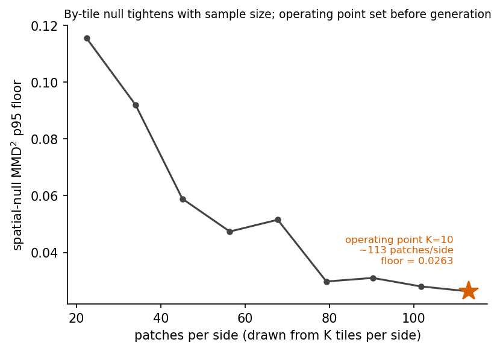
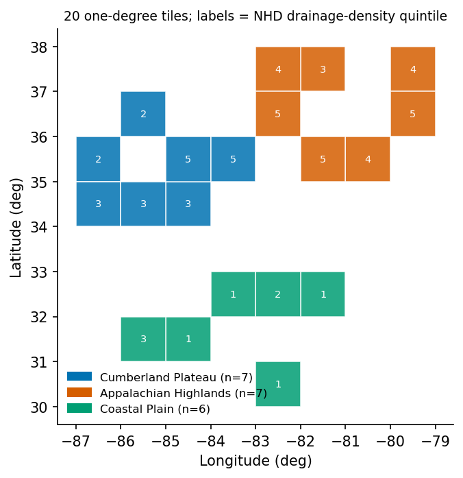
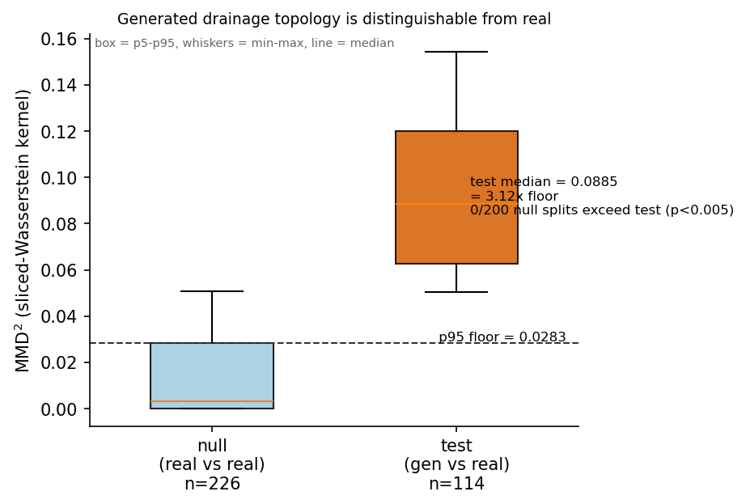
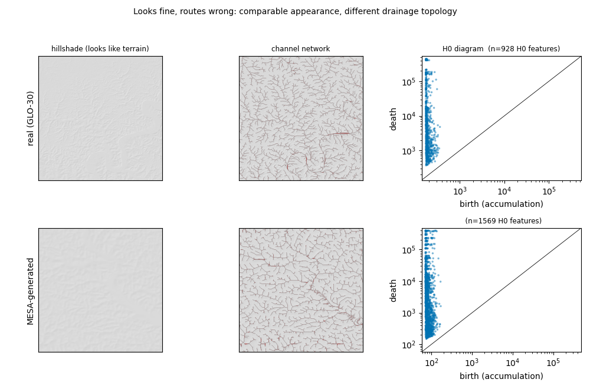
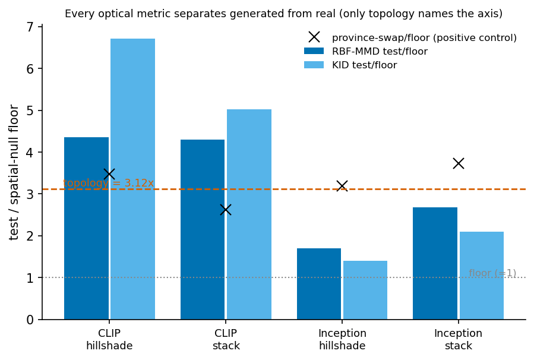
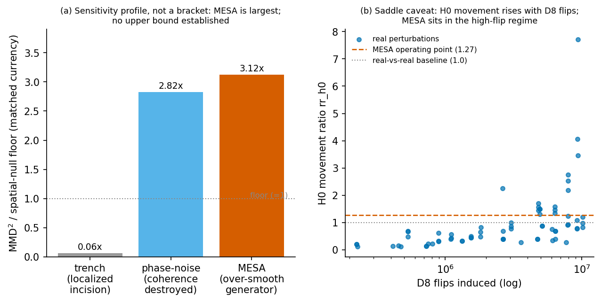

<!-- ============================================================================
FRAMING GUARDRAILS (do not let these regress while drafting; from the plan's
framing reconciliation):
 1. Headline novelty = the metric + evaluation regime + theorem stack.
 2. Construct validity vs NHD, SCOPED to karst across three CONUS provinces.
 3. MESA case study = INTERPRETABILITY / LOCALIZATION. Every metric separates
    generated from real; only the flow-accumulation metric NAMES the axis as
    drainage organization. The "optical is blind" headline is DEAD. Give CLIP its
    due (4.3x). Rewrite any "optical failed" as "detected an unlocalized fidelity
    gap".
 4. Sensitivity PROFILE, not a bracket: trench ~0, phase-noise 2.82x, MESA 3.12x.
    MESA is the LARGEST; no upper bound is established. The word "ceiling" must
    NOT appear. Trench and phase-scramble are two convergent characterizations of
    one invariance (the metric reads the branching distribution).
============================================================================= -->

# Introduction

<!-- DEFER prose to Phase 3 (its own session). Scaffold bullets only. -->

- Generative terrain models are advancing rapidly (diffusion and GAN families); evaluation has not kept pace.
- The field-default metrics are optical: FID and CLIP-based distances on rendered images. These score visual/textural fidelity, not the physical organization of the surface.
- Drainage-network organization (how water routes, where channels branch and converge) is a first-order property of real terrain and the thing downstream physical models care about. No standard generative metric reports it.
- Contribution: a drainage-aware topological evaluation regime, built on the H0 persistence of a flow-accumulation merge tree, construct-validated against NHD flowlines, with a small theorem stack relating it to standard drainage statistics.
- Worked case study: MESA [@bornepons2025mesa]. Result preview: every evaluated metric distinguishes MESA from real, but only the flow-accumulation metric names the axis of difference as drainage organization; optical metrics report an unlocalized embedding distance.

# Background and related work

<!-- DEFER prose to Phase 3. Bullets + citation keys to seed references.bib. -->

- Topological evaluation of generative models (non-terrain): @khrulkov2018; @horak2021; @barannikov2021; @suresh2025.
- TDA on terrain / DEMs: @edelsbrunner2002; @cohensteiner2007; terrain merge trees on spatial adjacency (@danner2007terrastream; @cousty2009watershed).
- Drainage-network topology: @horton1945; @strahler1957; @rodrigueziturbe1997.
- Terrain-specific evaluation: PTRM [@rajasekaran2022ptrm], the closest existing terrain metric, still perceptual not topological.
- The FID critique that motivates the optical contrast framing: @kynkaanniemi2023 (Inception features track ImageNet classes, not domain structure).
- The gap this bridges: no prior persistence-based distributional test for generative terrain, and no prior flow-accumulation filtration on a DEM (novelty; see `docs/topo_eval/notes/folklore_check.md`).

# The flow-accumulation persistence metric

<!-- DRAFT in Phase 2. Annotated scaffold + numbers + the translation imperative. -->

## Construct: from DEM to persistence diagram

- Pipeline: DEM -> hydrological conditioning -> D8 pointer and flow accumulation [@ocallaghan1984] -> donor-graph merge tree -> H0 persistence diagram. Implementation: `src/geo_tda/topo_eval/{hydrology,merge_tree}.py`. Tooling: WhiteboxTools [@lindsay2016whitebox].
- The donor graph: adjacency is the D8 donor relation (cells whose flow enters a cell), NOT spatial 8-adjacency. This is the sharpest novelty point (no prior terrain merge tree on the flow graph) and it removes spurious cycles (H1 = 0 by construction).
- Merge tree swept in ascending accumulation A on the channel mask {A >= tau}: births at channel heads, deaths at confluences. H0 persistence diagram = abelianization of the merge tree.

## Channelization threshold and scale invariance

- tau is calibrated PER PATCH to a common target drainage density (NHD median 1.732 km/km^2), not an arbitrary grid-cell count. `tau_for_target_density` in `pipeline.py`.
- TRANSLATION IMPERATIVE (state explicitly): matching tau to a physical NHD density is what makes the metric scale-invariant and maps the topological graph to real hydrology rather than abstraction. D8 routing is order-only, so H0 at matched density is invariant to elevation rescaling (verified: identical H0 feature count at x1 and x1000, `substrate_comparability.json`). Reviewers will target this; lead with the physical meaning.

{#fig-pipeline}

## Theoretical guarantees (statements here; proofs in Appendix A)

<!-- For EACH theorem, follow the statement with a plain-language physical
translation BEFORE the reader is asked to care about the proof. -->

- Bijection lemma: the donor-graph merge tree on the channel mask is in bijection with the channel network of the standard threshold-A hydrology workflow. [Physical translation: the topology is the channel network, not a proxy for it.]
- Theorem 1 (Strahler coarsening): Horton-Strahler order is a coarsening of the merge tree; standard drainage statistics factor through it. [Translation: the metric subsumes the bifurcation-ratio family geomorphologists already use.]
- Theorem 2 (PD abelianization): the persistence diagram forgets the branching pairing at confluences (equal-birth witness: balanced vs caterpillar tree, identical H0 barcodes, different Strahler distributions). [Translation: H0 captures the branching DISTRIBUTION, not which tributary joined which, which is exactly the invariance the sensitivity profile later confirms.]
- Theorem 3 (field-level stability, honest scope): the diagram is bottleneck-stable in the accumulation field [@cohensteiner2007], but NOT globally Lipschitz from the input DEM (D8 is discontinuous at saddles). [Translation: DEM-to-A instability is a property of drainage, small divide migrations reroute basins, not a defect of the metric. This is the saddle caveat that recurs in Results.]

# Two-sample testing framework

<!-- DRAFT in Phase 2. The autocorrelation guard + validity-over-precision floor. -->

## Statistic

- Sliced-Wasserstein kernel between H0 diagrams [@carriere2017]; MMD^2 two-sample statistic [@gretton2012]. `sliced_wasserstein`, `mmd2_from_matrix`, `global_sigma` in `distributional.py`.
- Global sigma fixed on the real-real block (sw_sigma = 7.21e6), so kernels are comparable across the null replicates.

## The spatial by-tile split null (the autocorrelation guard)

- A pooled/random-split null treats patches as exchangeable and scatters same-tile (autocorrelated, same-geology, same-density-regime) patches across both halves, shrinking the within-null MMD^2 and DEFLATING the floor: any test then clears an anti-conservative bar.
- The by-tile split holds out WHOLE TILES per side, reproducing the same spatial independence the generated-vs-real comparison has (generated shares no tile with real). `spatial_split_null_indexed` in `distributional.py`.
- VALIDITY OVER PRECISION (the calibrated-floor framing, not "tighter"): the independent units are TILES, so the effective sample is about 10 independent units per side, and the ~113 patches per side are drawn from those 10 tiles. State the 113-from-10 relationship ONCE, here, so the Discussion's effective-sample limitation does not read as a contradiction. Holding out whole tiles raises the floor's central location (it reflects real independence) while widening its sampling variability (fewer independent units): opposite-direction effects, so the honest claim is a correctly CALIBRATED floor, and the 3.12x clears that wider, properly-calibrated band.
- Null support: the floor is estimated from 200 random balanced by-tile splits (reps = 200, `m2_generated_vs_real.json`), a sampled subset of the C(20,10)/2 = 92378 possible balanced splits, not the full enumeration.

## Operating point and calibration

- K = 10 tiles per side (about 113 patches/side) is the max balanced split of 20 tiles, chosen for the largest tile-independent sample while preserving spatial independence: power balanced against independence.
- Two distinct floors exist and must be labeled distinctly (never conflated):
  - Pre-registered DESIGN floor: null p95 = 0.0263 (reps 120, `m2_power.json`), used to set the generation target before MESA was run.
  - Headline REALIZED floor: null p95 = 0.0283 (reps 200, `m2_generated_vs_real.json`), the denominator of the 3.12x.

{#fig-power}

# Data and study area

<!-- DRAFT in Phase 2. -->

- Region: karst terrain across three CONUS physiographic provinces: Cumberland Plateau, Appalachian Highlands, Coastal Plain. (Scope all validity claims to this setting; do not generalize past karst.)
- DEMs: USGS 3DEP (construct validity) and Copernicus GLO-30 [@copernicusdem] (MESA's training domain; the generated-vs-real comparison). Resolution invariance at matched density verified 3DEP vs GLO-30 (`resolution_probe.json`: elev_corr median 0.987, net Strahler-Wasserstein median 0.017).
- Reference: USGS NHD flowlines [@usgsnhd] for construct validity and the target drainage density (median 1.732 km/km^2).
- Tile manifest: 20 one-degree tiles selected across NHD drainage-density quintiles, province mix 7:7:6. 768 px patches (about 23 km). 226 patches with valid H0; per-tile yield 7-14 (mean 11.3). `tile_manifest.json`.
- MESA generation: province-mirrored prompts, FORCED mirror 40:40:34 (cumberland:appalachian:coastal) = the real reference mix so the two-sample test is not confounded by province mix; n = 114 patches at 768 px. `mesa_batch113_manifest.json`. [NOTE: the generated DEM .npy batch is not in this checkout; needed only for Fig 7.]
- Hardware floor: reported explicitly (local 12 GB GPU; full-tile runs windowed). Per `_evaluation_conventions.md`.
{#fig-studyarea}

# Results

<!-- DRAFT in Phase 2. Numbers slotted; figure/table callouts placed. -->

## Construct validity against NHD (karst, three CONUS provinces)

- Pre-registered against whitebox-vs-NHD as the agreement ceiling, n = 20. SCOPE the validity claim to karst / three CONUS provinces (glaciated, arid-endorheic, and other regimes were not tested; karst is a deliberate choice).
- PH vs NHD: junction-count correlation 0.936; Strahler Wasserstein-1 0.287; bifurcation-ratio |dR_b| 0.185. Whitebox vs NHD (ceiling): 0.935 / 0.287 / 0.375. All three pre-registered criteria pass; PH meets or beats the field-standard extractor. (`construct.json`.)
- Donor-graph sidebar: median 48,498 spurious 8-adjacency cycles per tile removed by construction (H1 = 0).


## Substrate comparability and statistical power

- Substrate comparability: MESA's [0,1] elevation is a valid drainage input; MESA median falls inside the real [p5, p95] band on all 11 scale-free routing descriptors; scale invariance holds (`substrate_comparability.json`). So the headline MMD reflects drainage divergence, not substrate degeneracy.
- Power: the spatial-null band tightens monotonically with sample size to the K=10 operating point (design floor 0.0263). The design is powered before generation.
- The by-tile null tightens monotonically with sample size to the K=10 operating point (@fig-power); the design is powered before generation.

## Headline: generated drainage topology is distributionally distinguishable from real

- At matched density, the H0 diagram population from MESA-generated terrain is distinguishable from real by the SW-kernel MMD against the by-tile null: test median MMD^2 = 0.0885 vs realized floor 0.0283, ratio 3.12x, all 200 null splits below the test (one-sided p = 0). n_real = 226, n_gen = 114. (`m2_generated_vs_real.json`.)
- Qualifier (saddle): the H0 movement sits at 1.27x the real-real baseline, in the high-flip saddle regime (`saddle_probe_A.json`), so the claim is distributional distinguishability of drainage topology, not proven gross network failure.


{#fig-headline}

{#fig-qualitative}

## Optical contrast: every metric separates, only topology names the axis

- Same operating point (K = 10) and the identical 114 generated patches; each optical metric uses its own real-real spatial null. POPULATION NOTE (reconcile in one sentence): topology is defined only on the 226 real windows with a valid non-degenerate H0 diagram (flat/water windows error out, `m2_power_analysis.py:148-151`); optical renders all 320 non-overlapping windows. The differing real-n is the natural domain of each metric, not a mismatch.
- Positive control is VALID: optical separates coastal-vs-mountain provinces but not the two mountainous provinces from each other (appalachian|cumberland near floor), so the instrument tracks genuine geomorphic appearance.
- Every optical metric separates generated from real (give CLIP its due): CLIP-hill RBF-MMD 4.36x, CLIP-stack 4.30x; Inception-hill 1.70x, Inception-stack 2.68x. KID: 6.72x / 5.03x / 1.40x / 2.10x. (Inception 2048-d FID skipped, unstable at n~160; KID reported.) (`m2_optical_contrast.json`.)
- Reading (INTERPRETABILITY, not "blind"): optical detects an unlocalized fidelity gap entangled with geomorphic appearance (CLIP separates generated from real MORE than it separates real provinces); the field-standard Inception is the weakest detector, consistent with @kynkaanniemi2023. Only the flow-accumulation metric names the axis of difference as drainage organization, validated against NHD.


{#fig-optical}

## Sensitivity profile of the metric (not a bracket)

<!-- Three perturbation classes in matched MMD^2/floor currency. NOT a bracket:
MESA is the LARGEST. No "ceiling". No upper bound claimed. -->

- Localized incision (randomized trench): H0 ratio stays ~0 across the f-sweep while optical rises (CLIP-stack to ~1.65x, Inception-stack to ~2.99x). H0 is invariant to a localized megachannel. (`m2_power_curve.json`.)
- Spatial-coherence destruction at fixed power spectrum (phase-randomized Fourier surrogate): 2.82x, BELOW MESA. (`m2_noise_vs_real.json`.) Phase-scramble preserves the branching distribution, so the metric reads it as near-real.
- MESA (over-smooth generator): 3.12x, the LARGEST of the three. No upper bound on the metric is established.
- Convergent characterization: the trench and the phase-scramble bound the metric's invariance from two directions; together they show H0 at matched density reads PERVASIVE BRANCHING-DISTRIBUTION structure, not localized features and not spatial coherence. MESA diverges because its over-smoothness changes the branching distribution itself.
- Referee-anticipating sentence (commit it): phase-randomized noise reads as closer to real than MESA because scrambling phase preserves the branching distribution the metric is built to read, while MESA changes that distribution.


{#fig-sensitivity}

# Discussion

<!-- DEFER prose to Phase 3. Bullets only. -->

- Interpretability framing: topology isolates and NAMES the drainage axis that optical metrics entangle with overall appearance. Optical is a contextualized baseline (detects-but-does-not-localize), not a foil that was beaten.
- Relation to optical metrics: concede detection (CLIP 4.3x), claim localization/interpretability. Do not start a sensitivity war against vision foundation models.
- Limitations (state plainly):
  - Saddle sensitivity: H0 movement is partly attributable to D8 saddle routing instability (Theorem 3); separating macro-structure from saddle noise needs the saddle-stable variant (future work).
  - Sensitivity profile, not a bound: we characterize three perturbation classes but establish no upper bound on the metric's response.
  - Single generator (MESA) as a worked case study; a multi-generator benchmark is separate work.
  - Single region: karst across three CONUS provinces; untested on other regimes.
  - Effective sample: about 10 independent tile-units per side (see Methods 2); the 113-patch count is not 113 independent draws.
  - Hardware windowing to 768 px patches; DEM-to-A non-Lipschitz at saddles.
- Independence sequencing: this evaluation regime is published before any constrained-generator paper that would use a related metric, to forestall circularity (`_evaluation_conventions.md`).

# Conclusions

<!-- DEFER prose to Phase 3. -->

# Appendix A: proofs

<!-- Port from docs/topo_eval/proofs/strahler_merge_tree.qmd. SUBMISSION BLOCKER:
the proof referee-pass is a hard pre-submission gate (the theorem stack is
headline novelty), named alongside the Cousty-Najman 2019 (JMIV) hardcopy
novelty skim. Not a finishing step. -->

- Lemma (bijection), Theorem 1 (Strahler coarsening), Theorem 2 (PD abelianization), Theorem 3 (field-level stability with honest scope).

# Code and data availability

- Code: `src/geo_tda/topo_eval/` and `scripts/`. Result JSONs: `results/validity/`. [Add repository DOI / archive on submission.]
- Data: 3DEP and GLO-30 DEMs and NHD flowlines are public (USGS, Copernicus); the MESA batch is reproducible from `scripts/mesa_generate.py`.

# Author contributions

- [TBD]

# Competing interests

- [TBD]

# Acknowledgements

- [TBD. GACRC compute; advisor input.]
